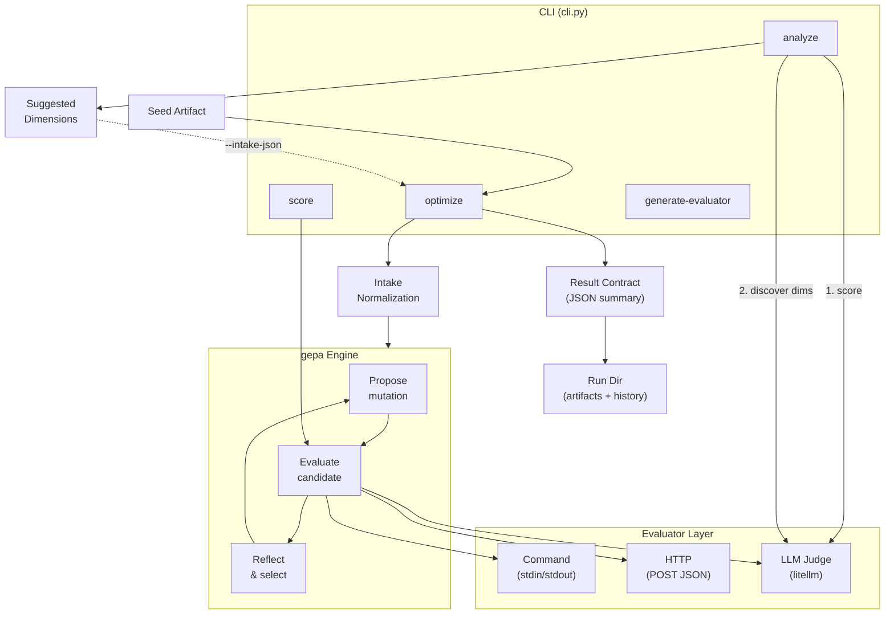

# optimize-anything

LLM-guided optimization for text artifacts using an iterative propose-evaluate-reflect loop with a bring-your-own evaluator.

## Quickstart

```bash
# 1. Install
curl -fsSL https://raw.githubusercontent.com/ASRagab/optimize-anything/main/install.sh | bash

# 2. Create a seed file
echo "Write a haiku about the ocean" > seed.txt

# 3. Create an evaluator (stdin JSON -> stdout JSON with score)
cat > eval.sh << 'EOF'
#!/usr/bin/env bash
python3 -c '
import json, sys
p = json.load(sys.stdin)
text = p["candidate"].lower()
score = (0.4 if "haiku" in text else 0) + (0.3 if "5-7-5" in text else 0) + (0.3 if "ocean" in text else 0)
print(json.dumps({"score": round(score, 2)}))
'
EOF
chmod +x eval.sh

# 4. Optimize
uv run optimize-anything optimize seed.txt \
  --evaluator-command bash ./eval.sh \
  --model openai/gpt-4o-mini \
  --budget 10 \
  --output result.txt
```

**What just happened?** The optimizer scored your seed, used an LLM to propose improved versions, and saved the best to `result.txt`. CLI stdout returns a JSON summary with `best_artifact`, `total_metric_calls`, `score_summary`, `top_diagnostics`, `plateau_guidance`, and optional `evaluator_failure_signal`.

**Core loop:** seed → evaluate → propose mutation → evaluate → reflect → repeat

## Why optimize-anything?

optimize-anything takes any text artifact (prompt, code, config), scores it with your evaluator, and uses an LLM to propose improvements — iterating until your budget runs out or the artifact converges.

- **BYO evaluator** — shell commands, HTTP endpoints, or LLM judges
- **Powered by gepa** — evolutionary search with LLM-guided mutations
- **Flexible** — optimize prompts, code, configs, or any text artifact
- **Auto-generate evaluators** — bootstrap scoring functions from objectives

## Install

**Terminal CLI** — installs the `optimize-anything` command:

```bash
# One-liner (installs uv if needed):
curl -fsSL https://raw.githubusercontent.com/ASRagab/optimize-anything/main/install.sh | bash

# Or directly with uv:
uv tool install git+https://github.com/ASRagab/optimize-anything
```

**Claude Code plugin** — skills + `/optimize` command inside Claude Code:

```bash
claude plugin add https://github.com/ASRagab/optimize-anything
```

> Requires [uv](https://docs.astral.sh/uv/) and Python >= 3.10. Plugin and CLI are independent — install either or both.

**From source** (for development):

```bash
git clone https://github.com/ASRagab/optimize-anything.git && cd optimize-anything
uv sync
```

## Evaluator Contract

Your evaluator receives JSON on stdin and returns JSON on stdout:

**Input:**
```json
{"candidate": "the text artifact being scored"}
```

**Output:**
```json
{"score": 0.75, "notes": "optional diagnostic text"}
```

- `score` (required): float, higher is better
- Additional fields become side information fed back to gepa's reflection LM

## Evaluator Types

### Command evaluator
Reads stdin JSON, writes stdout JSON:
```bash
optimize-anything optimize seed.txt --evaluator-command bash eval.sh
```

### HTTP evaluator
POST to a URL with JSON body:
```bash
optimize-anything optimize seed.txt --evaluator-url http://localhost:8080/evaluate
```

### LLM judge
Use an LLM to score artifacts directly (no evaluator script needed):
```bash
optimize-anything optimize seed.txt \
  --judge-model openai/gpt-4o-mini \
  --objective "Maximize clarity and specificity"
```

> **Tip:** For best results with `--judge-model`, provide `quality_dimensions` via `--intake-json` to give the judge specific scoring criteria.

## CLI Commands

### optimize

```bash
optimize-anything optimize <seed_file> [options]
```

| Flag | Description | Default |
|---|---|---|
| `--evaluator-command <cmd...>` | Shell command evaluator | -- |
| `--evaluator-url <url>` | HTTP POST evaluator | -- |
| `--judge-model <model>` | LLM judge evaluator | -- |
| `--objective <text>` | Natural language objective | -- |
| `--budget <n>` | Max evaluator invocations | 100 |
| `--model <model>` | Proposer LLM (e.g., `openai/gpt-4o-mini`) | env `OPTIMIZE_ANYTHING_MODEL` |
| `--output, -o <file>` | Write best candidate to file | stdout |
| `--diff` | Show seed vs best diff on stderr | -- |
| `--run-dir <path>` | Save run artifacts (auto-timestamped) | -- |
| `--spec-file <path>` | TOML spec file with bundled params | -- |

<details>
<summary>Advanced flags</summary>

| Flag | Description |
|---|---|
| `--evaluator-cwd <path>` | Working directory for evaluator command |
| `--judge-objective <text>` | Override objective for judge (falls back to `--objective`) |
| `--api-base <url>` | Override API base URL for litellm |
| `--background <text>` | Domain knowledge/constraints |
| `--intake-json <json>` | Inline evaluator intake spec |
| `--intake-file <path>` | Path to evaluator intake JSON file |

</details>

> **Note:** Always pass `--model` explicitly — gepa's default proposer may be unavailable in your environment.

Exactly one of `--evaluator-command`, `--evaluator-url`, or `--judge-model` is required.

### score

Score a single artifact without running optimization:

```bash
# With command evaluator
optimize-anything score artifact.txt --evaluator-command bash eval.sh

# With LLM judge
optimize-anything score artifact.txt \
  --judge-model openai/gpt-4o-mini \
  --objective "Score clarity, actionability, and specificity"
```

### analyze

Discover quality dimensions to improve LLM judge scoring:

```bash
optimize-anything analyze README.md \
  --judge-model anthropic/claude-sonnet-4-5-20250929 \
  --objective "Optimize for open-source project quality"
```

Returns a JSON object with `current_score`, `suggested_dimensions`, and a copy-paste `intake_json` for use with `optimize --intake-json`.

### generate-evaluator

Auto-generate a starter evaluator from a seed artifact and objective:

```bash
optimize-anything generate-evaluator seed.txt --objective "maximize clarity" > eval.sh
chmod +x eval.sh
```

### Other commands

| Command | Description |
|---|---|
| `explain <seed_file>` | Preview what optimization would do |
| `budget <seed_file>` | Recommend evaluation budget based on seed length |
| `intake [flags]` | Normalize and validate evaluator intake specification |

## Evaluator Runtime vs Pattern

Two similarly named fields serve different purposes:

| Field | What it answers | Allowed values |
|---|---|---|
| `execution_mode` | How the evaluator runs | `command`, `http` |
| `evaluation_pattern` | How scoring logic is designed | `verification`, `judge`, `simulation`, `composite` |

`execution_mode` decides `--evaluator-command` vs `--evaluator-url`. `evaluation_pattern` describes the scoring approach — it does not change transport.

Example intake spec with `quality_dimensions`, `hard_constraints`, `artifact_class`, and `evaluator_cwd`:

```json
{
  "artifact_class": "prompt",
  "execution_mode": "command",
  "evaluation_pattern": "judge",
  "quality_dimensions": [
    {"name": "clarity", "weight": 0.5},
    {"name": "constraint_adherence", "weight": 0.5}
  ],
  "hard_constraints": ["must be under 500 tokens"],
  "evaluator_cwd": "/path/to/project"
}
```

## Programmatic API

```python
from optimize_anything import optimize_anything, command_evaluator
from gepa.optimize_anything import GEPAConfig, EngineConfig

eval_fn = command_evaluator(["bash", "eval.sh"])
config = GEPAConfig(engine=EngineConfig(max_metric_calls=20))

result = optimize_anything(
    seed_candidate="initial text",
    evaluator=eval_fn,
    objective="maximize clarity",
    config=config,
)

print(result.best_candidate)
```

## Troubleshooting

| Problem | Fix |
|---|---|
| `ANTHROPIC_API_KEY missing` | Set `ANTHROPIC_API_KEY` in your environment |
| Evaluator fails | Test: `echo '{"candidate":"test"}' \| bash eval.sh` |
| Script not found | Use full path or `--evaluator-cwd` |
| Invalid JSON from evaluator | Ensure stdout is only JSON (logs go to stderr) |
| `--output must be a file path` | Pass a filename, not a directory |

## Architecture



| Module | Purpose |
|---|---|
| `cli.py` | CLI entry point: optimize, score, analyze, generate-evaluator, intake, explain, budget |
| `evaluators.py` | Command and HTTP evaluator factories |
| `llm_judge.py` | LLM-as-judge evaluator + dimension analysis (litellm) |
| `intake.py` | Intake schema normalization and validation |
| `result_contract.py` | Canonical optimize summary with plateau detection |
| `spec_loader.py` | TOML spec file loading for repeatable runs |
| `evaluator_generator.py` | Generate evaluator scripts from seed + objective |

## Uninstall

```bash
uv tool uninstall optimize-anything   # CLI
claude plugin remove optimize-anything # Plugin
```

## Learn More

- [Walkthrough](WALKTHROUGH.md) — step-by-step tutorial
- [Concepts](CONCEPTS.md) — architecture and glossary
